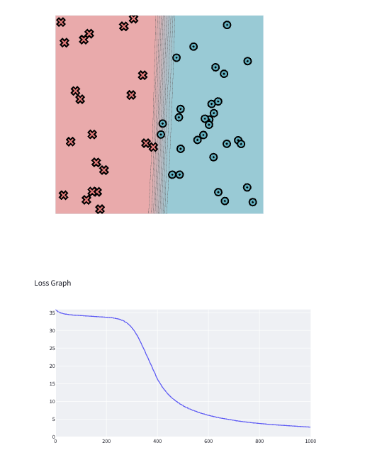
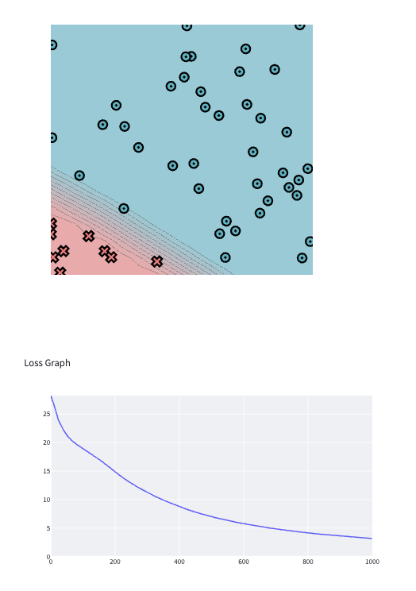
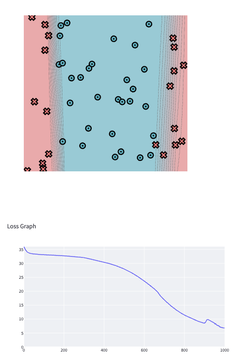
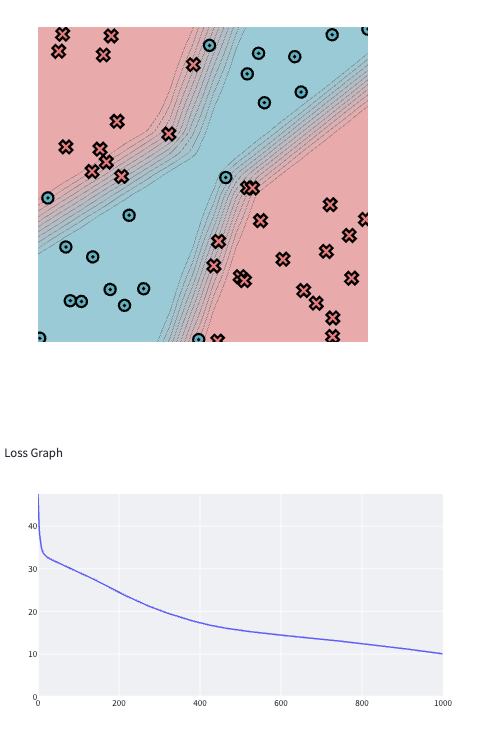
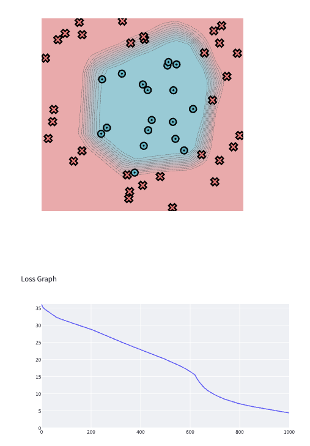
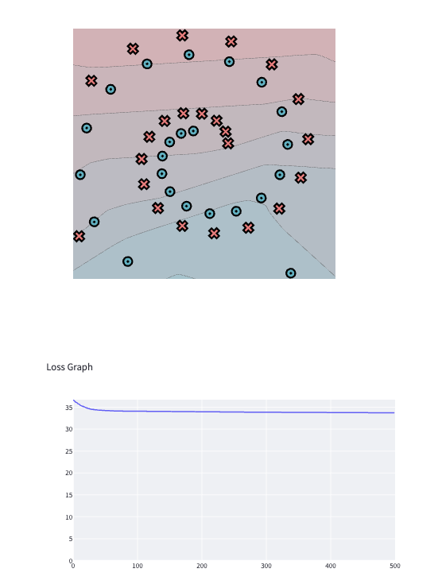

[](https://classroom.github.com/a/YFgwt0yY)
# MiniTorch Module 2


* Docs: https://minitorch.github.io/

* Overview: https://minitorch.github.io/module2/module2/

This assignment requires the following files from the previous assignments. You can get these by running

```bash
python sync_previous_module.py previous-module-dir current-module-dir
```

The files that will be synced are:

        minitorch/operators.py minitorch/module.py minitorch/autodiff.py minitorch/scalar.py minitorch/scalar_functions.py minitorch/module.py project/run_manual.py project/run_scalar.py project/datasets.py

# Task 2.5

## Dataset: Simple
### Hyperparameters & Time per epoch

Size of Hidden Layer: 2

Learning Rate: 0.1

Number of Epochs: 1000

Time Per Epoch: 0.043 s

### Screenshot of results & loss graph

### Logs
```markdown
Epoch: 0/1000, loss: 0, correct: 0
Epoch: 10/1000, loss: 35.324861023786724, correct: 29
Epoch: 20/1000, loss: 34.979292967802905, correct: 29
Epoch: 30/1000, loss: 34.762556169188606, correct: 29
Epoch: 40/1000, loss: 34.60816533372145, correct: 29
Epoch: 50/1000, loss: 34.494658287386784, correct: 29
Epoch: 60/1000, loss: 34.409481283892106, correct: 29
Epoch: 70/1000, loss: 34.33941778823167, correct: 29
Epoch: 80/1000, loss: 34.28032918855381, correct: 29
Epoch: 90/1000, loss: 34.229173428953956, correct: 29
Epoch: 100/1000, loss: 34.18366305636516, correct: 29
Epoch: 110/1000, loss: 34.142360229603405, correct: 29
Epoch: 120/1000, loss: 34.10401714029922, correct: 29
Epoch: 130/1000, loss: 34.067503752165166, correct: 29
Epoch: 140/1000, loss: 34.03175206067834, correct: 29
Epoch: 150/1000, loss: 33.99570816183279, correct: 29
Epoch: 160/1000, loss: 33.95828670354486, correct: 29
Epoch: 170/1000, loss: 33.9183235558928, correct: 29
Epoch: 180/1000, loss: 33.874522747147786, correct: 29
Epoch: 190/1000, loss: 33.82539321751465, correct: 29
Epoch: 200/1000, loss: 33.76890523190153, correct: 29
Epoch: 210/1000, loss: 33.70162634785459, correct: 29
Epoch: 220/1000, loss: 33.62072950664336, correct: 29
Epoch: 230/1000, loss: 33.515132970467306, correct: 29
Epoch: 240/1000, loss: 33.37644643737328, correct: 29
Epoch: 250/1000, loss: 33.19747033764854, correct: 29
Epoch: 260/1000, loss: 32.96590161119575, correct: 29
Epoch: 270/1000, loss: 32.63159103482849, correct: 29
Epoch: 280/1000, loss: 32.17286759649266, correct: 29
Epoch: 290/1000, loss: 31.55753810420218, correct: 29
Epoch: 300/1000, loss: 30.810799914876423, correct: 29
Epoch: 310/1000, loss: 29.857463342597406, correct: 29
Epoch: 320/1000, loss: 28.74806595249853, correct: 31
Epoch: 330/1000, loss: 27.411777179124368, correct: 35
Epoch: 340/1000, loss: 25.935262972313705, correct: 37
Epoch: 350/1000, loss: 24.333129642330835, correct: 37
Epoch: 360/1000, loss: 22.714843189862727, correct: 38
Epoch: 370/1000, loss: 21.065545631164394, correct: 43
Epoch: 380/1000, loss: 19.381632392589893, correct: 46
Epoch: 390/1000, loss: 17.79157018692383, correct: 46
Epoch: 400/1000, loss: 16.37305123630181, correct: 47
Epoch: 410/1000, loss: 15.146195902976357, correct: 47
Epoch: 420/1000, loss: 14.037470891927295, correct: 47
Epoch: 430/1000, loss: 13.090610866907916, correct: 47
Epoch: 440/1000, loss: 12.24687485471943, correct: 48
Epoch: 450/1000, loss: 11.510434420669528, correct: 48
Epoch: 460/1000, loss: 10.851948757527275, correct: 48
Epoch: 470/1000, loss: 10.272596903104944, correct: 48
Epoch: 480/1000, loss: 9.751202863011763, correct: 48
Epoch: 490/1000, loss: 9.277899483017775, correct: 48
Epoch: 500/1000, loss: 8.850987004439588, correct: 48
Epoch: 510/1000, loss: 8.467925326372471, correct: 48
Epoch: 520/1000, loss: 8.119441555394706, correct: 48
Epoch: 530/1000, loss: 7.800507402853984, correct: 48
Epoch: 540/1000, loss: 7.505715805690182, correct: 48
Epoch: 550/1000, loss: 7.232446901654254, correct: 48
Epoch: 560/1000, loss: 6.978467284372399, correct: 48
Epoch: 570/1000, loss: 6.741832072473783, correct: 48
Epoch: 580/1000, loss: 6.520842614067587, correct: 48
Epoch: 590/1000, loss: 6.314056151436294, correct: 49
Epoch: 600/1000, loss: 6.120112289235456, correct: 49
Epoch: 610/1000, loss: 5.937847524610134, correct: 49
Epoch: 620/1000, loss: 5.766234598661304, correct: 49
Epoch: 630/1000, loss: 5.604361670838522, correct: 49
Epoch: 640/1000, loss: 5.451417130747404, correct: 49
Epoch: 650/1000, loss: 5.306676652802244, correct: 49
Epoch: 660/1000, loss: 5.169492120653425, correct: 49
Epoch: 670/1000, loss: 5.039282122243077, correct: 49
Epoch: 680/1000, loss: 4.91552377029428, correct: 49
Epoch: 690/1000, loss: 4.797745645797326, correct: 49
Epoch: 700/1000, loss: 4.685521696298389, correct: 49
Epoch: 710/1000, loss: 4.578465948459609, correct: 49
Epoch: 720/1000, loss: 4.476227916894429, correct: 49
Epoch: 730/1000, loss: 4.378488609780329, correct: 49
Epoch: 740/1000, loss: 4.2849570470417095, correct: 49
Epoch: 750/1000, loss: 4.195466244596545, correct: 49
Epoch: 760/1000, loss: 4.110907677235945, correct: 49
Epoch: 770/1000, loss: 4.030468614928032, correct: 49
Epoch: 780/1000, loss: 3.954097444876914, correct: 49
Epoch: 790/1000, loss: 3.88070698042621, correct: 49
Epoch: 800/1000, loss: 3.8100520084325633, correct: 49
Epoch: 810/1000, loss: 3.741979293840301, correct: 49
Epoch: 820/1000, loss: 3.676346137446031, correct: 49
Epoch: 830/1000, loss: 3.6130188443170987, correct: 49
Epoch: 840/1000, loss: 3.551875081283296, correct: 49
Epoch: 850/1000, loss: 3.492801209087056, correct: 49
Epoch: 860/1000, loss: 3.435691501483645, correct: 49
Epoch: 870/1000, loss: 3.3804474491286767, correct: 49
Epoch: 880/1000, loss: 3.3269771373816996, correct: 49
Epoch: 890/1000, loss: 3.2751946888360424, correct: 49
Epoch: 900/1000, loss: 3.2250197626948034, correct: 49
Epoch: 910/1000, loss: 3.1763771042125484, correct: 49
Epoch: 920/1000, loss: 3.1291961383506157, correct: 50
Epoch: 930/1000, loss: 3.0834106025786863, correct: 50
Epoch: 940/1000, loss: 3.03895821442207, correct: 50
Epoch: 950/1000, loss: 2.995780369921603, correct: 50
Epoch: 960/1000, loss: 2.9538218696577467, correct: 50
Epoch: 970/1000, loss: 2.9130306694059973, correct: 50
Epoch: 980/1000, loss: 2.87335765284752, correct: 50
Epoch: 990/1000, loss: 2.8347564240668324, correct: 50
Epoch: 1000/1000, loss: 2.7971831178344226, correct: 50
```

## Dataset: Diag
### Hyperparameters & Time per epoch

Size of Hidden Layer: 2

Learning Rate: 0.05

Number of Epochs: 1000

Time Per Epoch: 0.044 s

### Screenshot of results & loss graph

### Logs
```markdown
Epoch: 0/500, loss: 0, correct: 0
Epoch: 10/1000, loss: 26.796853648100754, correct: 41
Epoch: 20/1000, loss: 24.670928449061414, correct: 41
Epoch: 30/1000, loss: 23.294028800452196, correct: 41
Epoch: 40/1000, loss: 22.23773152380469, correct: 41
Epoch: 50/1000, loss: 21.383305542942587, correct: 41
Epoch: 60/1000, loss: 20.691157295268813, correct: 41
Epoch: 70/1000, loss: 20.15961292404707, correct: 41
Epoch: 80/1000, loss: 19.731186335929383, correct: 41
Epoch: 90/1000, loss: 19.3565384403505, correct: 41
Epoch: 100/1000, loss: 19.00597443517483, correct: 41
Epoch: 110/1000, loss: 18.659642865060967, correct: 41
Epoch: 120/1000, loss: 18.30512921906882, correct: 41
Epoch: 130/1000, loss: 17.93431415689014, correct: 41
Epoch: 140/1000, loss: 17.54219488307977, correct: 41
Epoch: 150/1000, loss: 17.125641781621763, correct: 41
Epoch: 160/1000, loss: 16.682734874940515, correct: 41
Epoch: 170/1000, loss: 16.2123623082604, correct: 41
Epoch: 180/1000, loss: 15.743509523528331, correct: 41
Epoch: 190/1000, loss: 15.294688374229489, correct: 41
Epoch: 200/1000, loss: 14.863222612307114, correct: 41
Epoch: 210/1000, loss: 14.450402578121757, correct: 41
Epoch: 220/1000, loss: 14.033675883890567, correct: 41
Epoch: 230/1000, loss: 13.629438826022003, correct: 41
Epoch: 240/1000, loss: 13.254385795856525, correct: 41
Epoch: 250/1000, loss: 12.884098641182975, correct: 41
Epoch: 260/1000, loss: 12.530396289634854, correct: 41
Epoch: 270/1000, loss: 12.204851300773111, correct: 41
Epoch: 280/1000, loss: 11.889255894726954, correct: 41
Epoch: 290/1000, loss: 11.57903983931257, correct: 41
Epoch: 300/1000, loss: 11.272953322877564, correct: 41
Epoch: 310/1000, loss: 10.9710381329808, correct: 41
Epoch: 320/1000, loss: 10.691937795603826, correct: 41
Epoch: 330/1000, loss: 10.426107615170645, correct: 41
Epoch: 340/1000, loss: 10.171365966776388, correct: 41
Epoch: 350/1000, loss: 9.92437603886876, correct: 41
Epoch: 360/1000, loss: 9.683501131153937, correct: 41
Epoch: 370/1000, loss: 9.44828432234412, correct: 41
Epoch: 380/1000, loss: 9.21866876071159, correct: 41
Epoch: 390/1000, loss: 8.992145209504413, correct: 41
Epoch: 400/1000, loss: 8.768847446609342, correct: 41
Epoch: 410/1000, loss: 8.550590348643688, correct: 47
Epoch: 420/1000, loss: 8.345888191419872, correct: 48
Epoch: 430/1000, loss: 8.154603028709094, correct: 48
Epoch: 440/1000, loss: 7.971178866136602, correct: 48
Epoch: 450/1000, loss: 7.794813091434955, correct: 49
Epoch: 460/1000, loss: 7.625193852713603, correct: 49
Epoch: 470/1000, loss: 7.461727033505595, correct: 49
Epoch: 480/1000, loss: 7.3037570819939, correct: 49
Epoch: 490/1000, loss: 7.150786640837682, correct: 49
Epoch: 500/1000, loss: 7.002362469736282, correct: 49
Epoch: 510/1000, loss: 6.858694534336457, correct: 49
Epoch: 520/1000, loss: 6.720102348652802, correct: 49
Epoch: 530/1000, loss: 6.585487909016301, correct: 49
Epoch: 540/1000, loss: 6.455719232021589, correct: 49
Epoch: 550/1000, loss: 6.329401587302198, correct: 49
Epoch: 560/1000, loss: 6.207783800486366, correct: 49
Epoch: 570/1000, loss: 6.0899056055673535, correct: 49
Epoch: 580/1000, loss: 5.975231606460265, correct: 49
Epoch: 590/1000, loss: 5.864223080586711, correct: 49
Epoch: 600/1000, loss: 5.757551794588615, correct: 49
Epoch: 610/1000, loss: 5.652901028860356, correct: 49
Epoch: 620/1000, loss: 5.551850666179255, correct: 49
Epoch: 630/1000, loss: 5.452793598982886, correct: 49
Epoch: 640/1000, loss: 5.3572013127194875, correct: 49
Epoch: 650/1000, loss: 5.264382698548083, correct: 49
Epoch: 660/1000, loss: 5.174643825324887, correct: 49
Epoch: 670/1000, loss: 5.086716837055644, correct: 49
Epoch: 680/1000, loss: 5.001471465023877, correct: 49
Epoch: 690/1000, loss: 4.918712465986768, correct: 49
Epoch: 700/1000, loss: 4.838293859944679, correct: 49
Epoch: 710/1000, loss: 4.759764776180915, correct: 49
Epoch: 720/1000, loss: 4.68342125248807, correct: 49
Epoch: 730/1000, loss: 4.609148583860028, correct: 49
Epoch: 740/1000, loss: 4.536674636403963, correct: 49
Epoch: 750/1000, loss: 4.466349934421334, correct: 49
Epoch: 760/1000, loss: 4.39765253370976, correct: 49
Epoch: 770/1000, loss: 4.330744309492037, correct: 49
Epoch: 780/1000, loss: 4.265597244478549, correct: 49
Epoch: 790/1000, loss: 4.201970685485386, correct: 49
Epoch: 800/1000, loss: 4.1399716721344015, correct: 49
Epoch: 810/1000, loss: 4.079383829395796, correct: 49
Epoch: 820/1000, loss: 4.020319224316937, correct: 50
Epoch: 830/1000, loss: 3.9625731190548716, correct: 50
Epoch: 840/1000, loss: 3.9062553098813635, correct: 50
Epoch: 850/1000, loss: 3.8511714505884536, correct: 50
Epoch: 860/1000, loss: 3.7974278772147154, correct: 50
Epoch: 870/1000, loss: 3.744840084406699, correct: 50
Epoch: 880/1000, loss: 3.6935112305838094, correct: 50
Epoch: 890/1000, loss: 3.643267708118919, correct: 50
Epoch: 900/1000, loss: 3.5941471858465857, correct: 50
Epoch: 910/1000, loss: 3.546146625558341, correct: 50
Epoch: 920/1000, loss: 3.49916963410588, correct: 50
Epoch: 930/1000, loss: 3.4532019561991545, correct: 50
Epoch: 940/1000, loss: 3.408223865074854, correct: 50
Epoch: 950/1000, loss: 3.364205962085269, correct: 50
Epoch: 960/1000, loss: 3.3211199525231634, correct: 50
Epoch: 970/1000, loss: 3.278948965532314, correct: 50
Epoch: 980/1000, loss: 3.237681476442797, correct: 50
Epoch: 990/1000, loss: 3.197230989978065, correct: 50
Epoch: 1000/1000, loss: 3.1576092059445795, correct: 50
```

## Dataset: Split
### Hyperparameters & Time per epoch

Size of Hidden Layer: 3

Learning Rate: 0.1

Number of Epochs: 1000

Time Per Epoch: 0.062 s

### Screenshot of results & loss graph

### Logs
```markdown
Epoch: 0/1000, loss: 0, correct: 0
Epoch: 10/1000, loss: 34.800981369472204, correct: 21
Epoch: 20/1000, loss: 34.00177924682748, correct: 30
Epoch: 30/1000, loss: 33.64742827527202, correct: 30
Epoch: 40/1000, loss: 33.48150612491937, correct: 30
Epoch: 50/1000, loss: 33.39650766961731, correct: 30
Epoch: 60/1000, loss: 33.34156287198242, correct: 30
Epoch: 70/1000, loss: 33.26897242262446, correct: 30
Epoch: 80/1000, loss: 33.192358194035975, correct: 30
Epoch: 90/1000, loss: 33.138622486217415, correct: 30
Epoch: 100/1000, loss: 33.103024968447016, correct: 30
Epoch: 110/1000, loss: 33.07052754910077, correct: 30
Epoch: 120/1000, loss: 33.0378398528394, correct: 30
Epoch: 130/1000, loss: 33.00693242522699, correct: 30
Epoch: 140/1000, loss: 32.97439733203259, correct: 30
Epoch: 150/1000, loss: 32.940103166648356, correct: 30
Epoch: 160/1000, loss: 32.90393955804261, correct: 30
Epoch: 170/1000, loss: 32.86579904417511, correct: 30
Epoch: 180/1000, loss: 32.825570537885724, correct: 30
Epoch: 190/1000, loss: 32.78313662017116, correct: 30
Epoch: 200/1000, loss: 32.73110106000842, correct: 30
Epoch: 210/1000, loss: 32.68134186135197, correct: 30
Epoch: 220/1000, loss: 32.628431230203965, correct: 30
Epoch: 230/1000, loss: 32.572135103453434, correct: 30
Epoch: 240/1000, loss: 32.51220446768665, correct: 30
Epoch: 250/1000, loss: 32.448464361813315, correct: 30
Epoch: 260/1000, loss: 32.38056730947194, correct: 31
Epoch: 270/1000, loss: 32.30916203993937, correct: 31
Epoch: 280/1000, loss: 32.23735656321488, correct: 31
Epoch: 290/1000, loss: 32.16467136867158, correct: 32
Epoch: 300/1000, loss: 32.0900462346146, correct: 32
Epoch: 310/1000, loss: 31.95824256907608, correct: 33
Epoch: 320/1000, loss: 31.760374905064843, correct: 33
Epoch: 330/1000, loss: 31.595451405104296, correct: 33
Epoch: 340/1000, loss: 31.434976290243736, correct: 33
Epoch: 350/1000, loss: 31.267374514909836, correct: 34
Epoch: 360/1000, loss: 31.113829750124925, correct: 34
Epoch: 370/1000, loss: 30.960330180256786, correct: 34
Epoch: 380/1000, loss: 30.797629469744876, correct: 34
Epoch: 390/1000, loss: 30.624279622492413, correct: 34
Epoch: 400/1000, loss: 30.442893907372024, correct: 34
Epoch: 410/1000, loss: 30.26498985836427, correct: 34
Epoch: 420/1000, loss: 30.075202799454484, correct: 34
Epoch: 430/1000, loss: 29.87273075151379, correct: 35
Epoch: 440/1000, loss: 29.656677360934815, correct: 35
Epoch: 450/1000, loss: 29.42595282482646, correct: 35
Epoch: 460/1000, loss: 29.179942363071678, correct: 35
Epoch: 470/1000, loss: 28.916870630921448, correct: 35
Epoch: 480/1000, loss: 28.636858469891887, correct: 35
Epoch: 490/1000, loss: 28.338448178456634, correct: 36
Epoch: 500/1000, loss: 28.020855978181487, correct: 36
Epoch: 510/1000, loss: 27.682023686529902, correct: 36
Epoch: 520/1000, loss: 27.32209490175873, correct: 36
Epoch: 530/1000, loss: 26.943569419696658, correct: 37
Epoch: 540/1000, loss: 26.535594724260925, correct: 37
Epoch: 550/1000, loss: 26.110293960051592, correct: 37
Epoch: 560/1000, loss: 25.68436778909858, correct: 37
Epoch: 570/1000, loss: 25.198646469683936, correct: 37
Epoch: 580/1000, loss: 24.72507549256189, correct: 37
Epoch: 590/1000, loss: 24.224125084092034, correct: 38
Epoch: 600/1000, loss: 23.709005315552833, correct: 37
Epoch: 610/1000, loss: 23.16904880072414, correct: 38
Epoch: 620/1000, loss: 22.6096161021105, correct: 41
Epoch: 630/1000, loss: 22.035215667848423, correct: 43
Epoch: 640/1000, loss: 21.465129551886523, correct: 43
Epoch: 650/1000, loss: 20.868797771268618, correct: 44
Epoch: 660/1000, loss: 20.250268671831495, correct: 44
Epoch: 670/1000, loss: 19.517939826818356, correct: 48
Epoch: 680/1000, loss: 18.402411021474588, correct: 48
Epoch: 690/1000, loss: 17.648752657286064, correct: 49
Epoch: 700/1000, loss: 16.928408251234192, correct: 49
Epoch: 710/1000, loss: 16.257126503292593, correct: 49
Epoch: 720/1000, loss: 15.602687403553354, correct: 49
Epoch: 730/1000, loss: 14.978824551287273, correct: 49
Epoch: 740/1000, loss: 14.353672152821305, correct: 49
Epoch: 750/1000, loss: 13.844173511586966, correct: 49
Epoch: 760/1000, loss: 13.270436484144613, correct: 49
Epoch: 770/1000, loss: 12.812757879861536, correct: 49
Epoch: 780/1000, loss: 12.347020845194484, correct: 49
Epoch: 790/1000, loss: 11.889402898603329, correct: 49
Epoch: 800/1000, loss: 11.487553636987338, correct: 49
Epoch: 810/1000, loss: 11.124247366845168, correct: 49
Epoch: 820/1000, loss: 10.761708812753836, correct: 49
Epoch: 830/1000, loss: 10.421283093749002, correct: 49
Epoch: 840/1000, loss: 10.09929814581808, correct: 49
Epoch: 850/1000, loss: 9.754245291002496, correct: 49
Epoch: 860/1000, loss: 9.464910419711382, correct: 49
Epoch: 870/1000, loss: 9.19066044207148, correct: 49
Epoch: 880/1000, loss: 8.930115974720092, correct: 49
Epoch: 890/1000, loss: 8.685809972666016, correct: 49
Epoch: 900/1000, loss: 8.530865560998063, correct: 49
Epoch: 910/1000, loss: 9.484888055674684, correct: 50
Epoch: 920/1000, loss: 9.82321352536248, correct: 48
Epoch: 930/1000, loss: 9.370320988020593, correct: 49
Epoch: 940/1000, loss: 8.998339458517604, correct: 49
Epoch: 950/1000, loss: 8.43002624856301, correct: 50
Epoch: 960/1000, loss: 7.96462645913084, correct: 50
Epoch: 970/1000, loss: 7.62447582518934, correct: 50
Epoch: 980/1000, loss: 7.091393773388266, correct: 49
Epoch: 990/1000, loss: 6.911762240317143, correct: 49
Epoch: 1000/1000, loss: 6.755726448582592, correct: 49
```

## Dataset: Xor
### Hyperparameters & Time per epoch
Size of Hidden Layer: 6

Learning Rate: 0.1

Number of Epochs: 1000

Time Per Epoch: 0.129 s

### Screenshot of results & loss graph

### Logs
```markdown
Epoch: 0/1000, loss: 0, correct: 0
Epoch: 10/1000, loss: 34.7102169635078, correct: 30
Epoch: 20/1000, loss: 32.99713621064778, correct: 30
Epoch: 30/1000, loss: 32.351321200738816, correct: 30
Epoch: 40/1000, loss: 31.903513323840073, correct: 30
Epoch: 50/1000, loss: 31.508053301200235, correct: 30
Epoch: 60/1000, loss: 31.11054233042983, correct: 30
Epoch: 70/1000, loss: 30.691676375948468, correct: 30
Epoch: 80/1000, loss: 30.24553112705915, correct: 30
Epoch: 90/1000, loss: 29.817350229436478, correct: 30
Epoch: 100/1000, loss: 29.382721400954754, correct: 30
Epoch: 110/1000, loss: 28.93481430594, correct: 30
Epoch: 120/1000, loss: 28.46530265605226, correct: 30
Epoch: 130/1000, loss: 27.981157955516103, correct: 32
Epoch: 140/1000, loss: 27.48131622450848, correct: 33
Epoch: 150/1000, loss: 26.979082840006825, correct: 33
Epoch: 160/1000, loss: 26.474543867710224, correct: 37
Epoch: 170/1000, loss: 25.96844217974685, correct: 39
Epoch: 180/1000, loss: 25.469975609589262, correct: 41
Epoch: 190/1000, loss: 24.982443965626413, correct: 42
Epoch: 200/1000, loss: 24.50204229155501, correct: 44
Epoch: 210/1000, loss: 24.028078529537105, correct: 44
Epoch: 220/1000, loss: 23.56322125879236, correct: 45
Epoch: 230/1000, loss: 23.109287804317532, correct: 45
Epoch: 240/1000, loss: 22.666213116406283, correct: 45
Epoch: 250/1000, loss: 22.233488606513745, correct: 46
Epoch: 260/1000, loss: 21.81337396748538, correct: 46
Epoch: 270/1000, loss: 21.406816193061747, correct: 46
Epoch: 280/1000, loss: 21.015959342676783, correct: 46
Epoch: 290/1000, loss: 20.63998236500671, correct: 46
Epoch: 300/1000, loss: 20.278537126474923, correct: 46
Epoch: 310/1000, loss: 19.932520531228892, correct: 46
Epoch: 320/1000, loss: 19.603050689430304, correct: 45
Epoch: 330/1000, loss: 19.29028449630727, correct: 45
Epoch: 340/1000, loss: 18.98870920374856, correct: 45
Epoch: 350/1000, loss: 18.67628607954288, correct: 45
Epoch: 360/1000, loss: 18.376967472060592, correct: 44
Epoch: 370/1000, loss: 18.093279626778003, correct: 44
Epoch: 380/1000, loss: 17.82101525465755, correct: 44
Epoch: 390/1000, loss: 17.560721308523924, correct: 44
Epoch: 400/1000, loss: 17.317193513232226, correct: 44
Epoch: 410/1000, loss: 17.08892299612424, correct: 44
Epoch: 420/1000, loss: 16.868009039307825, correct: 44
Epoch: 430/1000, loss: 16.66119396162033, correct: 44
Epoch: 440/1000, loss: 16.468350283665202, correct: 44
Epoch: 450/1000, loss: 16.286697041374605, correct: 44
Epoch: 460/1000, loss: 16.120766011793705, correct: 44
Epoch: 470/1000, loss: 15.962268174829779, correct: 44
Epoch: 480/1000, loss: 15.816538660429858, correct: 44
Epoch: 490/1000, loss: 15.677080503628526, correct: 44
Epoch: 500/1000, loss: 15.543687302232538, correct: 44
Epoch: 510/1000, loss: 15.415503495203158, correct: 44
Epoch: 520/1000, loss: 15.29206108668363, correct: 44
Epoch: 530/1000, loss: 15.171985009510882, correct: 44
Epoch: 540/1000, loss: 15.055891462850687, correct: 44
Epoch: 550/1000, loss: 14.943230858407787, correct: 44
Epoch: 560/1000, loss: 14.835433574294912, correct: 44
Epoch: 570/1000, loss: 14.728728129031323, correct: 44
Epoch: 580/1000, loss: 14.625112100583053, correct: 44
Epoch: 590/1000, loss: 14.523365088701143, correct: 44
Epoch: 600/1000, loss: 14.422833834440214, correct: 44
Epoch: 610/1000, loss: 14.324397701238729, correct: 44
Epoch: 620/1000, loss: 14.22757767564441, correct: 44
Epoch: 630/1000, loss: 14.133029471145043, correct: 44
Epoch: 640/1000, loss: 14.038969926034872, correct: 44
Epoch: 650/1000, loss: 13.945308683117513, correct: 44
Epoch: 660/1000, loss: 13.85126495493973, correct: 44
Epoch: 670/1000, loss: 13.75696512974221, correct: 44
Epoch: 680/1000, loss: 13.661939929970542, correct: 44
Epoch: 690/1000, loss: 13.565895526205743, correct: 44
Epoch: 700/1000, loss: 13.470278365612874, correct: 45
Epoch: 710/1000, loss: 13.374280349250883, correct: 45
Epoch: 720/1000, loss: 13.27737052436933, correct: 45
Epoch: 730/1000, loss: 13.17997072393719, correct: 45
Epoch: 740/1000, loss: 13.081331975398125, correct: 45
Epoch: 750/1000, loss: 12.981623021493926, correct: 45
Epoch: 760/1000, loss: 12.88052900666862, correct: 45
Epoch: 770/1000, loss: 12.777765893246853, correct: 45
Epoch: 780/1000, loss: 12.673669593616518, correct: 45
Epoch: 790/1000, loss: 12.567968198735354, correct: 45
Epoch: 800/1000, loss: 12.460668243779288, correct: 45
Epoch: 810/1000, loss: 12.351712293541471, correct: 45
Epoch: 820/1000, loss: 12.24105459841998, correct: 45
Epoch: 830/1000, loss: 12.128692541193724, correct: 45
Epoch: 840/1000, loss: 12.014654695198383, correct: 46
Epoch: 850/1000, loss: 11.898998801232363, correct: 46
Epoch: 860/1000, loss: 11.781628347243355, correct: 46
Epoch: 870/1000, loss: 11.66327916636326, correct: 46
Epoch: 880/1000, loss: 11.543848583624635, correct: 47
Epoch: 890/1000, loss: 11.423073090904138, correct: 47
Epoch: 900/1000, loss: 11.300931428540007, correct: 47
Epoch: 910/1000, loss: 11.17746148514285, correct: 47
Epoch: 920/1000, loss: 11.052777564743348, correct: 47
Epoch: 930/1000, loss: 10.926967358341724, correct: 47
Epoch: 940/1000, loss: 10.800121075088954, correct: 47
Epoch: 950/1000, loss: 10.672304696226727, correct: 47
Epoch: 960/1000, loss: 10.543745151533011, correct: 47
Epoch: 970/1000, loss: 10.414595022807692, correct: 48
Epoch: 980/1000, loss: 10.285017634988384, correct: 48
Epoch: 990/1000, loss: 10.154955871122278, correct: 48
Epoch: 1000/1000, loss: 10.025414727545355, correct: 48
```

## Dataset: Circle
### Hyperparameters & Time per epoch
Size of Hidden Layer: 8

Learning Rate: 0.1

Number of Epochs: 1000

Time Per Epoch: 0.194 s

### Screenshot of results & loss graph

### Logs
```markdown
Epoch: 0/1000, loss: 0, correct: 0
Epoch: 10/1000, loss: 34.910257770480655, correct: 25
Epoch: 20/1000, loss: 34.369290929871156, correct: 26
Epoch: 30/1000, loss: 33.84914687369259, correct: 27
Epoch: 40/1000, loss: 33.31471024111485, correct: 27
Epoch: 50/1000, loss: 32.88152647448581, correct 29
Epoch: 60/1000, loss: 32.315526581517666, correct: 32
Epoch: 70/1000, loss: 32.03569990205553, correct: 32
Epoch: 80/1000, loss: 31.75389329610896, correct: 32
Epoch: 90/1000, loss: 31.491693832767307, correct: 32
Epoch: 100/1000, loss: 31.261004556086718, correct: 32
Epoch: 110/1000, loss: 31.041391976146674, correct: 32
Epoch: 120/1000, loss: 30.789750112138854, correct: 32
Epoch: 130/1000, loss: 30.563620946372236, correct: 32
Epoch: 140/1000, loss: 30.332797205461645, correct: 32
Epoch: 150/1000, loss: 30.096629573522836, correct: 32
Epoch: 160/1000, loss: 29.853598571644312, correct: 32
Epoch: 170/1000, loss: 29.603946247875893, correct: 32
Epoch: 180/1000, loss: 29.347251871941154, correct: 32
Epoch: 190/1000, loss: 29.083444808420648, correct: 32
Epoch: 200/1000, loss: 28.81221958983054, correct: 32
Epoch: 210/1000, loss: 28.534274359647238, correct: 32
Epoch: 220/1000, loss: 28.25023270525942, correct: 32
Epoch: 230/1000, loss: 27.959861194867116, correct: 32
Epoch: 240/1000, loss: 27.664800264507978, correct: 32
Epoch: 250/1000, loss: 27.35458733873952, correct: 32
Epoch: 260/1000, loss: 27.041361918749555, correct: 33
Epoch: 270/1000, loss: 26.725327924920684, correct: 37
Epoch: 280/1000, loss: 26.40805210353856, correct: 34
Epoch: 290/1000, loss: 26.091950976220872, correct: 34
Epoch: 300/1000, loss: 25.778796410559412, correct: 35
Epoch: 310/1000, loss: 25.469341789466, correct: 36
Epoch: 320/1000, loss: 25.164412044760322, correct: 36
Epoch: 330/1000, loss: 24.865420099754157, correct: 39
Epoch: 340/1000, loss: 24.574112463688035, correct: 40
Epoch: 350/1000, loss: 24.290742624825533, correct: 40
Epoch: 360/1000, loss: 24.01458707739203, correct: 40
Epoch: 370/1000, loss: 23.7484318710334, correct: 40
Epoch: 380/1000, loss: 23.461317154532345, correct: 40
Epoch: 390/1000, loss: 23.183573553837718, correct: 40
Epoch: 400/1000, loss: 22.913389855273813, correct: 40
Epoch: 410/1000, loss: 22.6470162683639, correct: 40
Epoch: 420/1000, loss: 22.387335312142486, correct: 40
Epoch: 430/1000, loss: 22.12603583755527, correct: 40
Epoch: 440/1000, loss: 21.85729830745456, correct: 40
Epoch: 450/1000, loss: 21.54788222963764, correct: 40
Epoch: 460/1000, loss: 21.26288731859292, correct: 40
Epoch: 470/1000, loss: 20.973119947780223, correct: 40
Epoch: 480/1000, loss: 20.67578988269822, correct: 40
Epoch: 490/1000, loss: 20.37264527937522, correct: 40
Epoch: 500/1000, loss: 20.060830086824925, correct: 40
Epoch: 510/1000, loss: 19.747788517297533, correct: 40
Epoch: 520/1000, loss: 19.428058948563145, correct: 41
Epoch: 530/1000, loss: 19.11328768999301, correct: 42
Epoch: 540/1000, loss: 18.795935477955535, correct: 42
Epoch: 550/1000, loss: 18.476500980576056, correct: 42
Epoch: 560/1000, loss: 18.127277116670744, correct: 42
Epoch: 570/1000, loss: 17.77634007251903, correct: 42
Epoch: 580/1000, loss: 17.397942700349514, correct: 42
Epoch: 590/1000, loss: 16.95561492817486, correct: 42
Epoch: 600/1000, loss: 16.50826340285667, correct: 42
Epoch: 610/1000, loss: 16.045240019643597, correct: 42
Epoch: 620/1000, loss: 15.497744973495868, correct: 42
Epoch: 630/1000, loss: 14.243415793809177, correct: 44
Epoch: 640/1000, loss: 13.226227784513007, correct: 46
Epoch: 650/1000, loss: 12.362728933478042, correct: 48
Epoch: 660/1000, loss: 11.60696499925291, correct: 48
Epoch: 670/1000, loss: 11.014914955106148, correct: 49
Epoch: 680/1000, loss: 10.532128393788804, correct: 49
Epoch: 690/1000, loss: 10.102823809309863, correct: 49
Epoch: 700/1000, loss: 9.71052516264208, correct: 49
Epoch: 710/1000, loss: 9.350988702304576, correct: 49
Epoch: 720/1000, loss: 9.01954158763393, correct: 49
Epoch: 730/1000, loss: 8.715074749165352, correct: 49
Epoch: 740/1000, loss: 8.415693504110155, correct: 49
Epoch: 750/1000, loss: 8.150412522947216, correct: 49
Epoch: 760/1000, loss: 7.91011081359785, correct: 49
Epoch: 770/1000, loss: 7.675548503451444, correct: 49
Epoch: 780/1000, loss: 7.4680343689443225, correct: 49
Epoch: 790/1000, loss: 7.267746694367229, correct: 49
Epoch: 800/1000, loss: 7.080150753611661, correct: 49
Epoch: 810/1000, loss: 6.897666234069595, correct: 49
Epoch: 820/1000, loss: 6.733037011407304, correct: 49
Epoch: 830/1000, loss: 6.57266018726633, correct: 49
Epoch: 840/1000, loss: 6.426369227423289, correct: 49
Epoch: 850/1000, loss: 6.281895379644815, correct: 49
Epoch: 860/1000, loss: 6.146764070541288, correct: 49
Epoch: 870/1000, loss: 6.017827305156193, correct: 49
Epoch: 880/1000, loss: 5.8969654021070905, correct: 49
Epoch: 890/1000, loss: 5.7655931651309515, correct: 49
Epoch: 900/1000, loss: 5.634841712798699, correct: 49
Epoch: 910/1000, loss: 5.512039604389628, correct: 49
Epoch: 920/1000, loss: 5.397133552288438, correct: 49
Epoch: 930/1000, loss: 5.2876650887602255, correct: 49
Epoch: 940/1000, loss: 5.184797574358462, correct: 49
Epoch: 950/1000, loss: 5.085778440585865, correct: 49
Epoch: 960/1000, loss: 4.9506670049831145, correct: 49
Epoch: 970/1000, loss: 4.794413006280127, correct: 49
Epoch: 980/1000, loss: 4.650424879351059, correct: 49
Epoch: 990/1000, loss: 4.5179206096160645, correct: 49
Epoch: 1000/1000, loss: 4.3952151466738325, correct: 49
```

## Dataset: Spiral
### Hyperparameters & Time per epoch

Size of Hidden Layer: 12

Learning Rate: 0.1

Number of Epochs: 500

Time Per Epoch: 0.352 s

### Screenshot of results & loss graph
```markdown
¯\___(ツ)___/¯
```

### Logs
```markdown
Epoch: 0/1000, loss: 0, correct: 0
Epoch: 10/500, loss: 35.75860205442132, correct: 21
Epoch: 20/500, loss: 34.90233325514038, correct: 25
Epoch: 30/500, loss: 34.52409878737715, correct: 28
Epoch: 40/500, loss: 34.34915268432056, correct: 26
Epoch: 50/500, loss: 34.25167441145252, correct: 28
Epoch: 60/500, loss: 34.17911006568044, correct: 30
Epoch: 70/500, loss: 34.135183609751124, correct: 29
Epoch: 80/500, loss: 34.09215724724745, correct: 29
Epoch: 90/500, loss: 34.06780815316398, correct: 29
Epoch: 100/500, loss: 34.04173533693545, correct: 29
Epoch: 110/500, loss: 34.02249287676516, correct: 29
Epoch: 120/500, loss: 34.00392691760152, correct: 29
Epoch: 130/500, loss: 33.988582428950444, correct: 29
Epoch: 140/500, loss: 33.97645175170596, correct: 28
Epoch: 150/500, loss: 33.965093616296215, correct: 28
Epoch: 160/500, loss: 33.95586030479411, correct: 28
Epoch: 170/500, loss: 33.946895613470595, correct: 28
Epoch: 180/500, loss: 33.93813006625011, correct: 28
Epoch: 190/500, loss: 33.93228397570402, correct: 28
Epoch: 200/500, loss: 33.923256593683, correct: 29
Epoch: 210/500, loss: 33.915281546111416, correct: 29
Epoch: 220/500, loss: 33.90939220486641, correct: 29
Epoch: 230/500, loss: 33.90181287918126, correct: 29
Epoch: 240/500, loss: 33.895621904058544, correct: 29
Epoch: 250/500, loss: 33.88981052836461, correct: 29
Epoch: 260/500, loss: 33.88015260268561, correct: 29
Epoch: 270/500, loss: 33.87777885706603, correct: 29
Epoch: 280/500, loss: 33.87348510096015, correct: 29
Epoch: 290/500, loss: 33.86910317666321, correct: 29
Epoch: 300/500, loss: 33.86215033563204, correct: 29
Epoch: 310/500, loss: 33.858227493775054, correct: 29
Epoch: 320/500, loss: 33.85454706339097, correct: 29
Epoch: 330/500, loss: 33.851008722828624, correct: 29
Epoch: 340/500, loss: 33.84796935230692, correct: 29
Epoch: 350/500, loss: 33.83904307002479, correct: 29
Epoch: 360/500, loss: 33.829156115456556, correct: 29
Epoch: 370/500, loss: 33.822874391403296, correct: 30
Epoch: 380/500, loss: 33.81842410254542, correct: 30
Epoch: 390/500, loss: 33.815881744211374, correct: 30
Epoch: 400/500, loss: 33.811448422680826, correct: 30
Epoch: 410/500, loss: 33.806951501174375, correct: 30
Epoch: 420/500, loss: 33.80382885658549, correct: 30
Epoch: 430/500, loss: 33.80161624360904, correct: 29
Epoch: 440/500, loss: 33.79674753902898, correct: 30
Epoch: 450/500, loss: 33.79312664865819, correct: 30
Epoch: 460/500, loss: 33.78956132963753, correct: 30
Epoch: 470/500, loss: 33.75997452765746, correct: 31
Epoch: 480/500, loss: 33.74502185807202, correct: 31
Epoch: 490/500, loss: 33.73969787182741, correct: 31
Epoch: 500/500, loss: 33.73549001590513, correct: 31
```